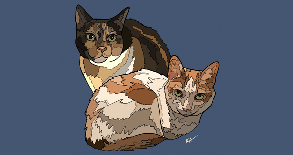

# Hi there 👋, I'm 2231puppy/Micha

## I'm an aspiring fullstack developer

_I commissioned this beautiful art of my cats from [@TheColorfulKayak](https://www.instagram.com/TheColorfulKayak/)_

I think JS should be illegal 99% of the time (TS is the GOAT!) 3D printing is awesome. I want to learn low level development. Linux > macOS > Windows (for programming at least)

Skills: TS / Svelte / SvelteKit // TailwindCSS // Python / FastAPI // Godot

- 🔭 I’m currently working on a cool multiplayer combat-based MMO (yes, it's gonna take a while)
- 🌱 I’m currently learning relational database schemas.
- 👯 I’m looking to collaborate on just about anything!
- 🤔 I’m looking for help with whatever problems you see with my code!
- 💬 Ask me about 3D printing!
- 📫 How to reach me: Just drop me an email (this domain without the .tech part, at gmail dot com)
- 😄 Pronouns: he/him
- ⚡ Fun fact: I LOVE to build robots!

