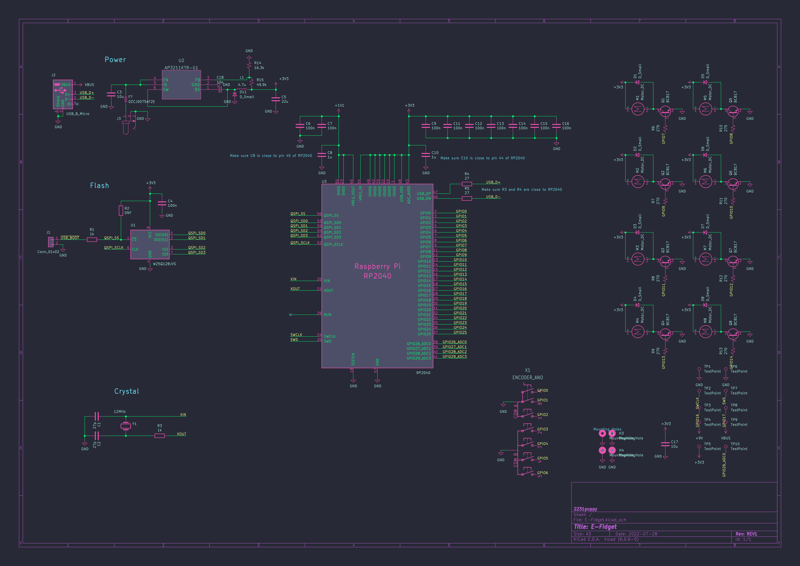

+++
title = "E-Fidget project - Update 1"
date = 2022-08-06T04:00:00.000Z
draft = false
tags = [ "Current Projects", "Hardware", "Updates" ]
+++

Hi! I've been working a little on the schematic for the E-Fidget, and it's going great! Here's what I have:

_(For those wondering, this is KiCad 6 with the Dracula color scheme on macOS.)_

There are some changes that I have planned, like switching out the transistors for FETs (Thanks for suggesting that, you know who you are!). Cleaning up the schematic is also on my agenda. In the meantime, I've started on the layout, but I don't think
that's ready to share quite yet (It's ugly and not 10% done). However, what I will say is that the final board will likely be a 4-layer, 40mm (~1.6 inch) radius circle. I'll be sure to make another post soon with more info!

P.S. This will be a 100% OSHW and OSS project when I'm done!
