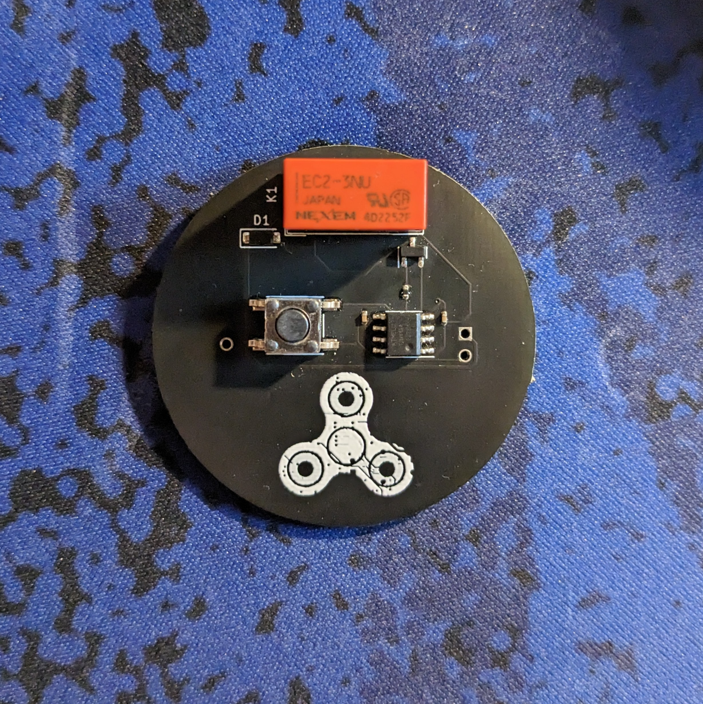
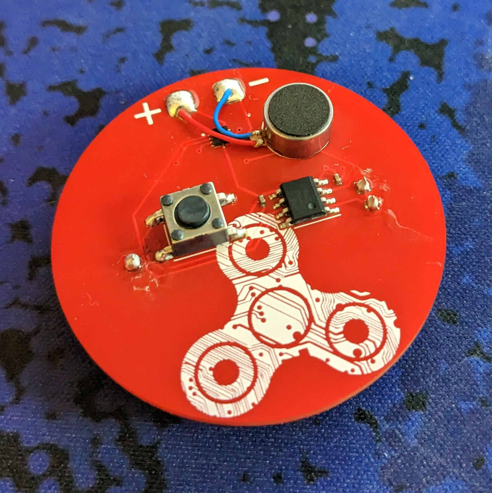

+++
title = "E-Fidget - Update 3"
date = 2023-08-24T04:00:00.000Z
draft = false
tags = [ "Current Projects", "Hardware", "Updates" ]
+++

*Yes, I know it's been almost a full year since my last update.*
*Sorry - I'll try to not let that happen again!*

Hey everyone! My last post on the E-Fidget was a quick status update on version 1.
Since then, I've gone through 2 other versions of the main E-Fidget and two versions
of its little sibling, the E-Fidget Lite.

The most recent version of the E-Fidget (The E-Fidget Lite V2, if you're keeping count)
is the most successful version so far! It uses a LRA motor to deliver sharp and accurate
haptic feedback. As you can imagine, the cost of these PCBs adds up fast. Thankfully,
PCBWay sponsored this version of the E-Fidget. They offer fast and professional services
that you can always count on, and their support team is friendly and helpful!

I'm looking forward to sharing this project with the world!
Check back soon for more details!

Thanks for reading!
